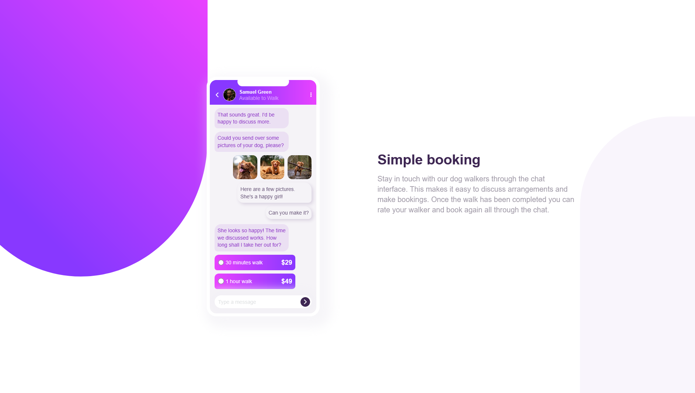

# Frontend Mentor - Chat app CSS illustration solution

This is a solution to the [Chat app CSS illustration challenge on Frontend Mentor](https://www.frontendmentor.io/challenges/chat-app-css-illustration-O5auMkFqY). Frontend Mentor challenges help you improve your coding skills by building realistic projects.

## Table of contents

- [Overview](#overview)
  - [The challenge](#the-challenge)
  - [Screenshot](#screenshot)
  - [Links](#links)
- [My process](#my-process)
  - [Built with](#built-with)
  - [What I learned](#what-i-learned)
  - [Continued development](#continued-development)
- [Author](#author)

## Overview

Chat app illustration using HTML and CSS.

### The challenge

Users should be able to:

- View the optimal layout for the component depending on their device's screen size
- **Bonus**: See the chat interface animate on the initial load

### Screenshot

### Links

- Solution URL: 
- Live Site URL: 

## My process

I built this component using the Bottom-up approach and also used the mobile first workflow.

### Built with

- Semantic HTML5 markup
- CSS custom properties
- Flexbox
- CSS Grid
- Mobile-first workflow

### What I learned

Since this was my first time building this sort of project, i learned how to build the chat application and also how to position the texts and the images in the chat.

### Continued development

I realized at some point that my code was not clean. It was definitely able to solve the problem, but it was not the neatest way to solve that problem so i hope to continue honing my web development skills in order to write clean and semantic HTML and CSS code.

## Author

- Frontend Mentor - [@yourusername](https://www.frontendmentor.io/profile/samimkabiru)
